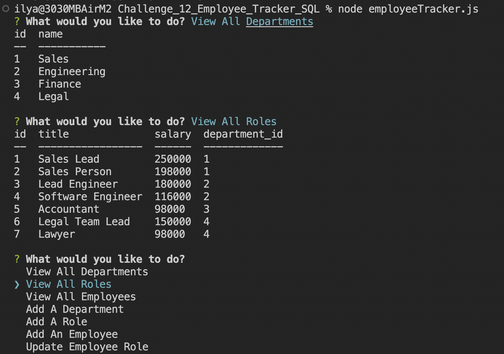

 

# Challenge_12_Employee_Tracker_SQL
Node Inquirer app to view and manage the departments, roles, and employees in a company so that you can organize and plan your business.

# Table of Contents 

* [Technology used](#Technology%20used)
* [Installation](#Installation)
* [Usage](#Usage)
* [License](#License)

# Technologies Used

* Node
* npm
* inquirer
* MySQL

# Installation 

From the command line change directory to where you cloned this repository to then type 'npm i', then to run it enter 'node employeeTracker.js'

# Usage
Check out my [video tutorial](https://drive.google.com/file/d/19py3mz-mGpiBMoSpCJcP0W_KyAzuTbhJ/view?usp=sharing) to see it running.

# Functionality
* View All Departments
* View All Employess
* View All Roles
* Add A Department
* Add An Employee
* Add A Role
* Update Employee Role

# License
MIT License

Copyright (c) 2022 illtron3030

Permission is hereby granted, free of charge, to any person obtaining a copy 
of this software and associated documentation files (the "Software"), to deal
in the Software without restriction, including without limitation the rights
to use, copy, modify, merge, publish, distribute, sublicense, and/or sell
copies of the Software, and to permit persons to whom the Software is
furnished to do so, subject to the following conditions:

The above copyright notice and this permission notice shall be included in all
copies or substantial portions of the Software.

THE SOFTWARE IS PROVIDED "AS IS", WITHOUT WARRANTY OF ANY KIND, EXPRESS OR
IMPLIED, INCLUDING BUT NOT LIMITED TO THE WARRANTIES OF MERCHANTABILITY,
FITNESS FOR A PARTICULAR PURPOSE AND NONINFRINGEMENT. IN NO EVENT SHALL THE
AUTHORS OR COPYRIGHT HOLDERS BE LIABLE FOR ANY CLAIM, DAMAGES OR OTHER
LIABILITY, WHETHER IN AN ACTION OF CONTRACT, TORT OR OTHERWISE, ARISING FROM,
OUT OF OR IN CONNECTION WITH THE SOFTWARE OR THE USE OR OTHER DEALINGS IN THE
SOFTWARE.